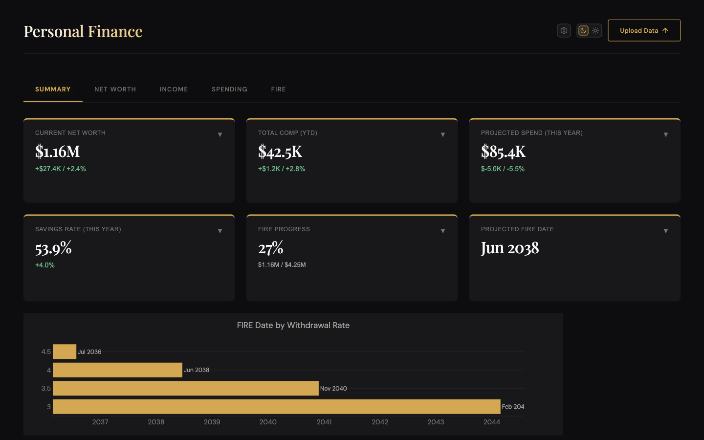
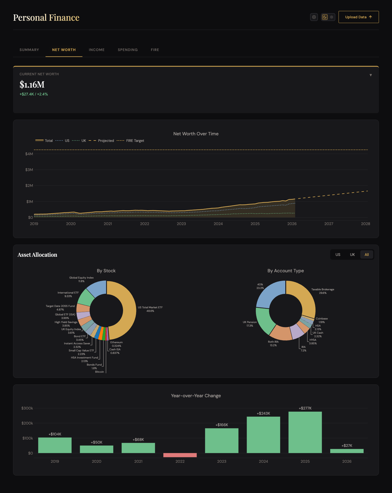
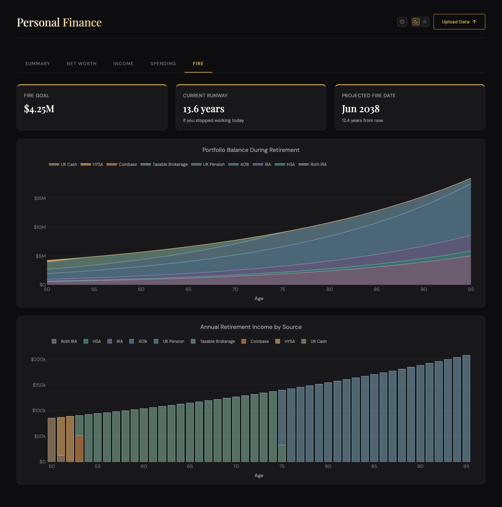
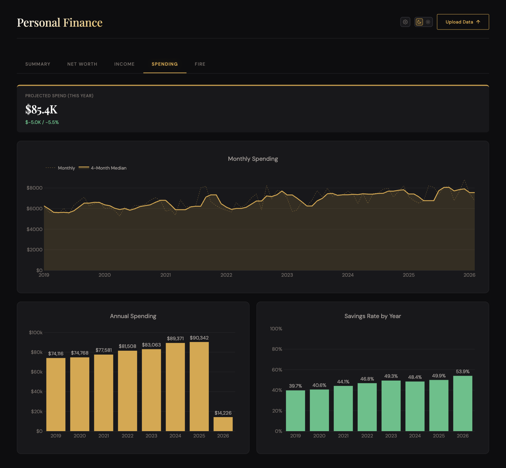
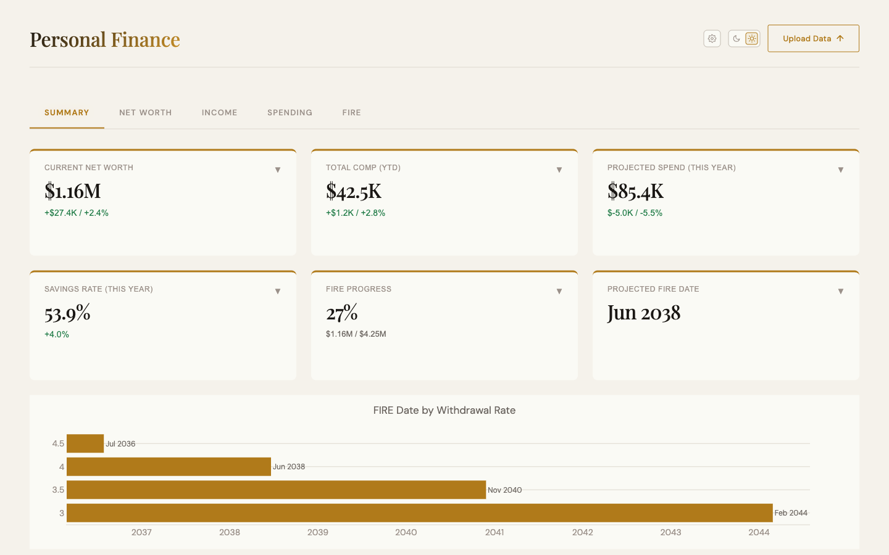

# Personal Finance Dashboard

A self-hosted personal finance dashboard for tracking net worth, income, spending, savings rate, and FIRE (Financial Independence, Retire Early) projections across US and UK accounts.

**Your financial data never leaves your browser.** Upload an Excel file, explore your finances, close the tab — nothing is stored or transmitted.



---

## Features

| Tab | What It Shows |
| --- | --- |
| **Summary** | Net worth snapshot, YTD income, projected annual spending, savings rate, FIRE progress |
| **Net Worth** | Net worth over time (US + UK), YoY changes, asset allocation by stock and account type |
| **Income** | Annual gross vs. net income comparison |
| **Spending** | Monthly spending with rolling median, annual totals, savings rate by year |
| **FIRE** | Retirement runway simulation, portfolio drawdown by account, withdrawal sources |

---

## Screenshots

<table>
  <tr>
    <td></td>
    <td></td>
  </tr>
  <tr>
    <td align="center"><em>Net Worth</em></td>
    <td align="center"><em>FIRE projections</em></td>
  </tr>
  <tr>
    <td></td>
    <td></td>
  </tr>
  <tr>
    <td align="center"><em>Spending</em></td>
    <td align="center"><em>Light mode</em></td>
  </tr>
</table>

---

## Privacy: Your Data Stays Local

This dashboard is a **fully static site** — there is no backend, no database, and no server that receives your data. When you upload your Excel file:

1. The file is read directly by your browser using the [xlsx](https://sheetjs.com/) library
2. Data is loaded into [DuckDB-WASM](https://duckdb.org/docs/api/wasm/overview.html), an in-browser SQL engine running as a WebAssembly module
3. All queries and calculations execute locally inside the browser tab
4. When you close or refresh the tab, all data is gone

### How to Verify

You can confirm no data is uploaded using your browser's built-in developer tools:

1. Open the dashboard and press **F12** (or `Cmd+Option+I` on Mac) to open DevTools
2. Click the **Network** tab
3. Upload your Excel file
4. Filter requests by **Fetch/XHR** (Chrome) or **XHR** (Firefox)

You will see requests only for static assets (`.js`, `.wasm`, `.css` files loaded once on startup) — never any POST requests containing your financial data. The WASM files are the DuckDB engine itself being downloaded to run locally.

---

## Tech Stack

| Concern | Technology |
| --- | --- |
| Framework | [Svelte 5](https://svelte.dev/) + [Vite](https://vitejs.dev/) + TypeScript |
| In-browser SQL | [DuckDB-WASM](https://duckdb.org/docs/api/wasm/overview.html) |
| Charts | [Plotly.js](https://plotly.com/javascript/) |
| Excel parsing | [xlsx (SheetJS)](https://sheetjs.com/) |
| Numeric precision | [decimal.js](https://mikemcl.github.io/decimal.js/) |
| Hosting | GitHub Pages (static) |

---

## Data Format

The dashboard reads a single `.xlsx` file downloaded from a Google Sheet. The Google Sheet has two layers:

- **Input sheets** — where you enter data each month
- **Output sheets** — formula-driven; read by the dashboard. Do not edit these directly.

### Input sheets

#### `US Monthly` — one row per month (date = last day of month)

| Column | Type | Notes |
| --- | --- | --- |
| `Date` | date | Last day of the month, e.g. `2026-04-30` |
| `Cash` | number | USD cash & savings balances |
| `Taxable Brokerage` | number | |
| `Roth IRA` | number | |
| `401k` | number | |
| `HSA` | number | |
| `US Spend` | number | Total USD spending for the month |
| `Net Override` | number | **Historical only (yellow).** Leave blank for new entries — `Net USD` computes from the account columns above. |
| `Net USD` _(green)_ | formula | `=IF(Net Override > 0, Net Override, Cash + Taxable + Roth IRA + 401k + HSA)` — do not edit |
| `Notes` | text | Optional |

#### `UK Monthly` — one row per month (date = last day of month)

| Column | Type | Notes |
| --- | --- | --- |
| `Date` | date | Last day of the month |
| `Cash (£)` | number | GBP cash & savings |
| `ETFs (£)` | number | |
| `Pension (£)` | number | |
| `UK Spend (£)` | number | Total GBP spending for the month |
| `GBP/USD` | number | Exchange rate at month-end, e.g. `1.27` |
| `Net Override (£)` | number | **Historical only (yellow).** Leave blank for new entries. |
| `Net GBP` _(green)_ | formula | `=IF(Net Override > 0, Net Override, Cash + ETFs + Pension)` — do not edit |
| `Notes` | text | Optional |

#### `Paychecks` — one row per payment event (multiple rows per month are fine)

| Column | Type | Notes |
| --- | --- | --- |
| `Date` | date | Pay date |
| `Gross` | number | Pre-tax amount |
| `Pension Contrib` | number | Employer + employee pension contributions |
| `Approx Tax Reserves` | number | Estimated tax liability — for your reference only, not used by the dashboard |
| `Net` | number | Take-home amount |
| `GBP/USD` | number | `1.0` for USD paychecks; exchange rate for GBP paychecks |
| `Notes` | text | Optional |

#### `US Asset Allocation` and `UK Asset Allocation` — current holdings snapshot

Overwrite these monthly with your current positions. They are not time-series — only the latest values are shown in the dashboard.

| Column | Notes |
| --- | --- |
| `Account Type` | e.g. `Taxable Brokerage`, `Roth IRA`, `401k`, `UK Pension` |
| `Asset` | Ticker or description, e.g. `VTI` |
| `Value` | Current value in local currency |
| `Conversion` | GBP/USD rate (`1.0` for US sheet) |

---

### How the dashboard reads the file

The dashboard detects the consolidated format by checking for a `US Monthly` sheet and reads the five input sheets directly — no separate output sheets are needed. All derivations (net worth totals, spend totals, income columns) are computed in the browser loader at upload time.

| Derived table | Source sheet | Logic |
| --- | --- | --- |
| `us_networth` | `US Monthly` | `Net USD = Net Override` if set, else sum of account columns; only rows where `Net USD > 0` |
| `uk_networth` | `UK Monthly` | `Net GBP = Net Override` if set, else sum of account columns; only rows where `Net GBP > 0` |
| `us_spend` | `US Monthly` | `US Spend` column; all rows |
| `uk_spend` | `UK Monthly` | `UK Spend (£)` column; all rows |
| `total_comp` | `Paychecks` | `Gross`, `Pension Contrib`, `Net`, `GBP/USD`; `Approx Tax Reserves` is skipped |

All `Conversion` values are the GBP/USD exchange rate at the time of the row (`1.0` for USD-denominated rows).

---

### Monthly update workflow

1. Open the Google Sheet in Google Drive
2. Append one row to **`US Monthly`**: fill in account balances and US spending; leave `Net Override` blank
3. Append one row to **`UK Monthly`**: fill in account balances, GBP spending, and the current GBP/USD rate; leave `Net Override` blank
4. Append one or more rows to **`Paychecks`** for each payment received that month
5. Overwrite **`US Asset Allocation`** and **`UK Asset Allocation`** with your current holdings if you want the allocation charts updated
6. `File → Download → Microsoft Excel (.xlsx)`
7. Upload the downloaded file to the dashboard

---

### Migrating from an existing file

If you have a previous `PersonalFinance.xlsx`, run the migration script to produce a new file with the correct structure:

```bash
python scripts/migrate_personal_finance.py
# reads:  data/PersonalFinance.xlsx
# writes: data/PersonalFinance_migrated.xlsx
```

Then upload `data/PersonalFinance_migrated.xlsx` to Google Drive and convert it to Google Sheets format (`File → Save as Google Sheets`). Historical net worth totals are migrated into the `Net Override` column (highlighted yellow); per-account breakdowns are not available from historical data and default to zero.

---

## Running Locally

```bash
cd static-site
npm install
npm run dev
```

Then open [http://localhost:5173](http://localhost:5173).

To build for production:

```bash
npm run build   # outputs to static-site/dist/
```

---

## FIRE Methodology

The FIRE tab uses a **Least Absolute Deviation (LAD) regression** on historical net worth data to project a FIRE date. LAD is preferred over ordinary least squares because it is robust to outliers (market crashes, windfalls) that would skew an OLS fit.

The projected FIRE date is calculated against a hardcoded goal of **$4,250,000** at safe withdrawal rates of 3%, 3.5%, 4%, and 4.5%.

The retirement drawdown simulation applies account-specific growth rates and models the withdrawal order across account types (taxable → tax-deferred → tax-free) to project portfolio longevity.
